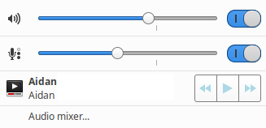
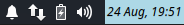

## XFCE 4.14 Panelbar Theming

----

### CSS Selectors

#### Classes:

    .xfce4-panel
    .tasklist

#### ID's:

    #whiskermenu-button
    #xfce4-notification-plugin
    #xfce4-power-manager-plugin
    #pulseaudio-button
    #clock-button

#### Elements

    wnck-pager

----

### GTK3 Theme testing and debugging

For testing, you can make modifications in the override file located at `~/.config/gtk-3.0/gtk.css`. If the directory path doesn't exist, then you will have to create it.

    mkdir -p  ~/.config/gtk-3.0

To see your modifications applied, you can reset the xfce4-panel process by typing the following command into a terminal:

    xfce4-panel -r

For debugging, you can use the [GtkInspector tool from GNOME.](https://wiki.gnome.org/action/show/Projects/GTK/Inspector?action=show&redirect=Projects%2FGTK%2B%2FInspector). To inspect the XFCE panelbar and its plugins, you can perform the following:

Kill the current xfce panel process:

    pkill xfce4-panel

Start the panel process with GtkInspector debugging enabled:

    GTK_DEBUG=interactive xfce4-panel

----

### Plugin theming examples

Panelbar background color.

    .xfce4-panel.background {
      background-color: rgba(36, 36, 36, 0.8); }

Tasklist toggle button background colour, text color, and border radius.

    .tasklist .toggle {
      background-color: lightblue;
      color: black;
      border-radius: 3px; }

Whisker Menu panel button.

    #whiskermenu-button label {
      color: lightblue;
      font-weight: bold;
      font-style: italic; }

Pulseaudio menu mpris buttons.

    #pulseaudio-button menu .linked button {
      color: lightblue;   /* This will apply a colour to the mpris button icons */
      border-color: gray; }  /* This will apply a colour to the mpris button border */

*The pulseaudio menu contains common GTK widgets such as a scale, trough, switch, and slider.*

Workspace switcher colours for selected and hover states.

    wnck-pager:selected {
      background-color: lightblue; }
    wnck-pager:hover {
      background-color: gray; }

Clock colours and font style:

    #clock-button {
      color: black;
      font-style: italic;
      background-color: lightblue; }

----

